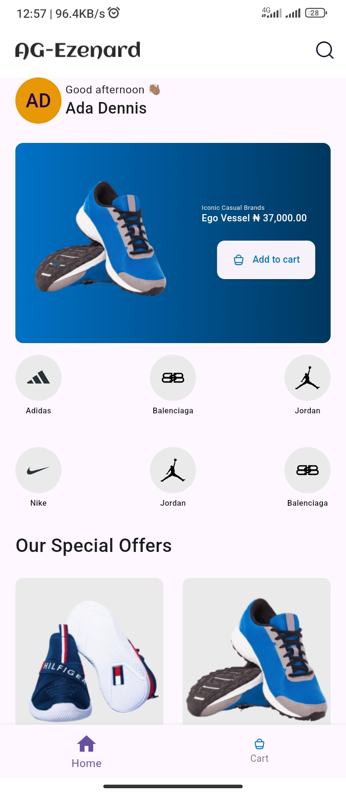
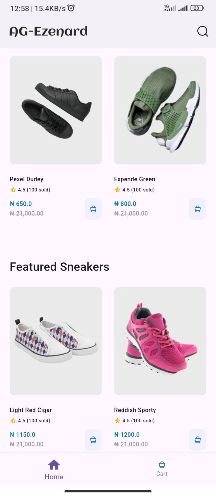
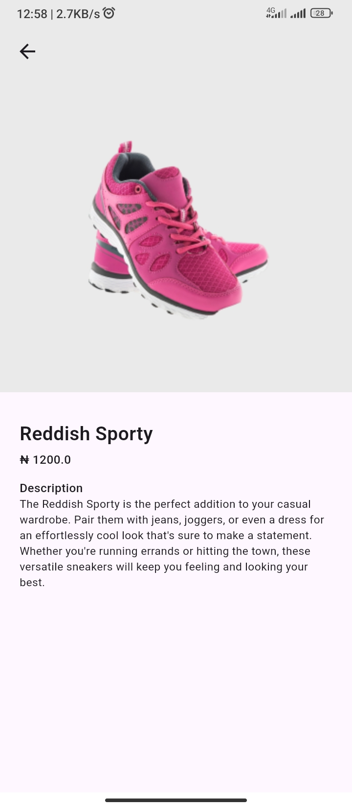
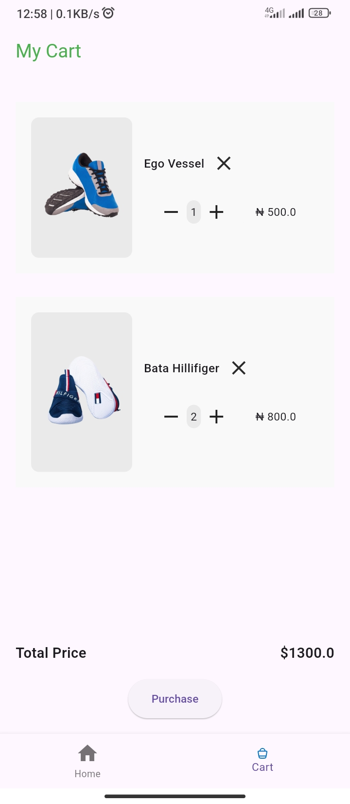

# shoe_plug
This app fetches products from Timbu and displays the necessary data.

## Getting Started
- Ensure you have Flutter installed
- Run `flutter pub get` after cloning
- Get your credentials (APP_ID, API_KEY,ORGANISATION_ID ) from [Timbu](https://app.timbu.cloud)
- Add the credentials to secret environment for security, [this](https://pub.dev/documentation/dart_define/latest/) explains it better
- Run `flutter run --dart-define-from-file=$pathToYourSecretFile` on your prefered device

[Appetize link](https://appetize.io/app/b_w7vg7y5vrupyvtn7cozah5cove)

[APK link](https://drive.google.com/file/d/1kyhLIoM4q3B0SLGffzZ9dwepsAeLSufa/view?usp=sharing)

[Demo link](https://drive.google.com/file/d/1FecLmcBa6PLGdCIIhhymjsBU6odBNHnT/view?usp=sharing)

## Screenshots

