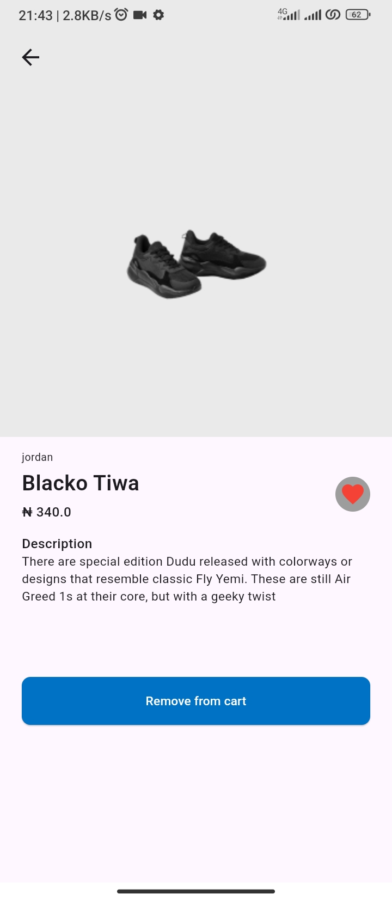

# shoe_plug
This app fetches products from Timbu and displays the necessary data.

## Getting Started
- Ensure you have Flutter installed
- Run `flutter pub get` after cloning
- Get your credentials (APP_ID, API_KEY,ORGANISATION_ID ) from [Timbu](https://app.timbu.cloud)
- Add the credentials to secret environment for security, [this](https://pub.dev/documentation/dart_define/latest/) explains it better
- Run `flutter run --dart-define-from-file=$pathToYourSecretFile` on your prefered device

# Features
- Fetching products from Timbu
- Getting categories based on brands
- Adding and removing a product from wishlist
- Adding and removing a product from cart 
- Simulation of checkout
- Accessing order history

# Packages used
- flutter_svg
- http
- hive
- shimmer

[Appetize link](https://appetize.io/app/b_cobd6hdiq6ogcpkicmhiiv5xom)

[APK link](https://drive.google.com/file/d/1zYI1NNiWe-jisiJQbwk9Cn_aSoD4dRHt/view?usp=drive_link)

[Demo link](https://drive.google.com/file/d/17MlccgYnZZXJVi6oU7etd2kKonbF4AjG/view?usp=drive_link)

## Screenshots

